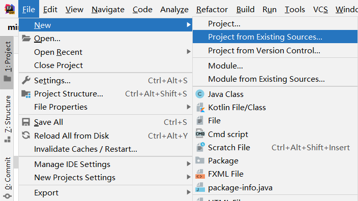
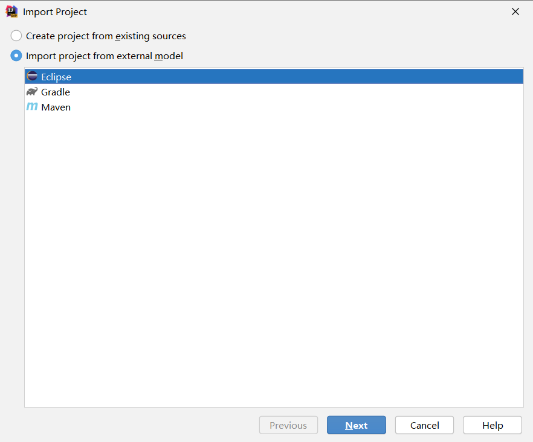
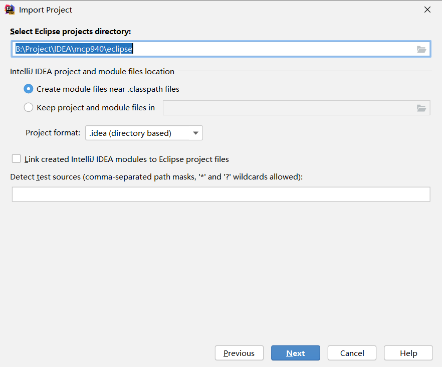
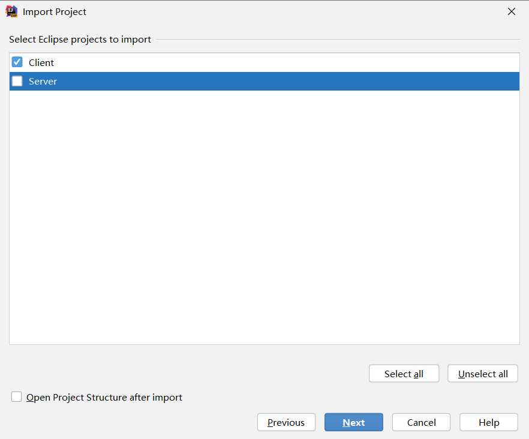
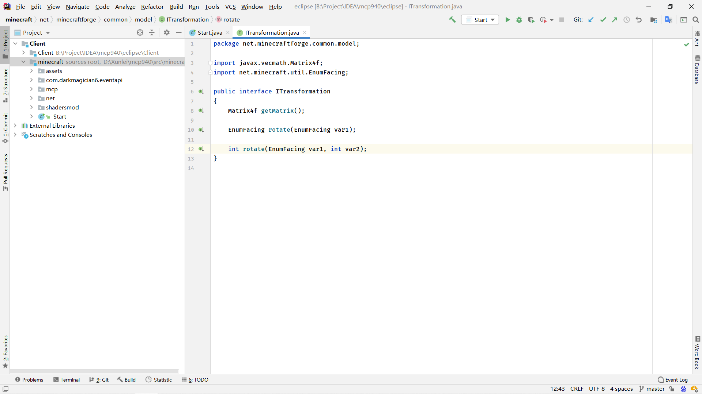
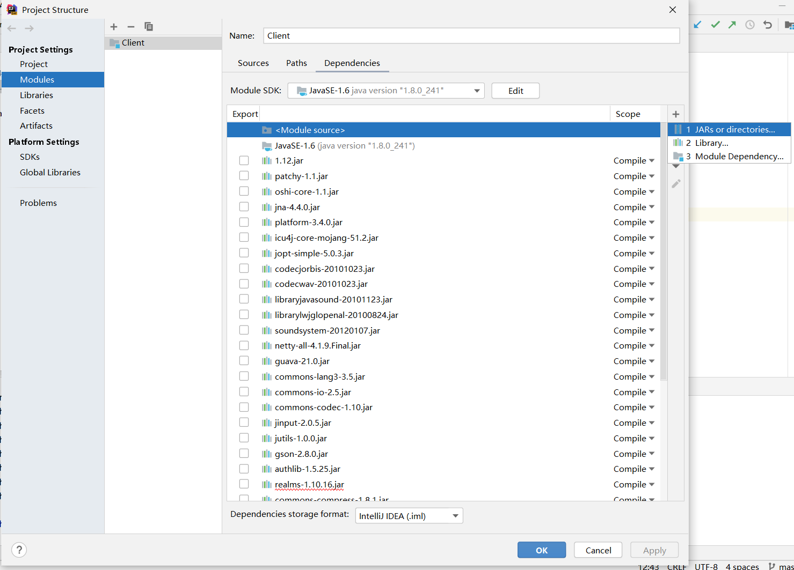
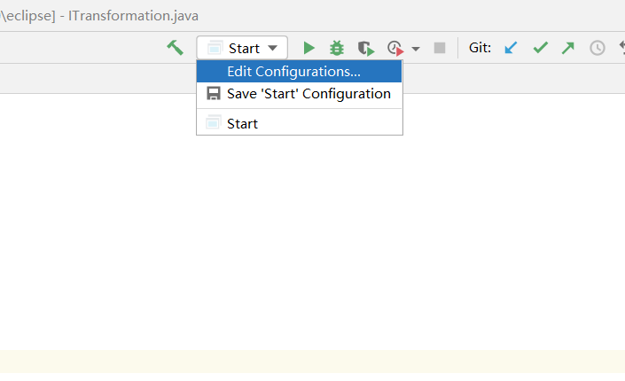
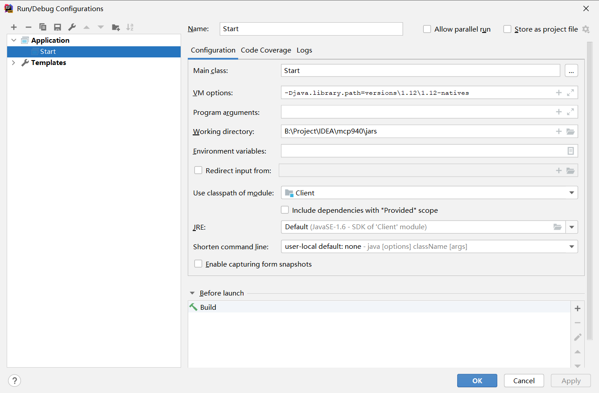
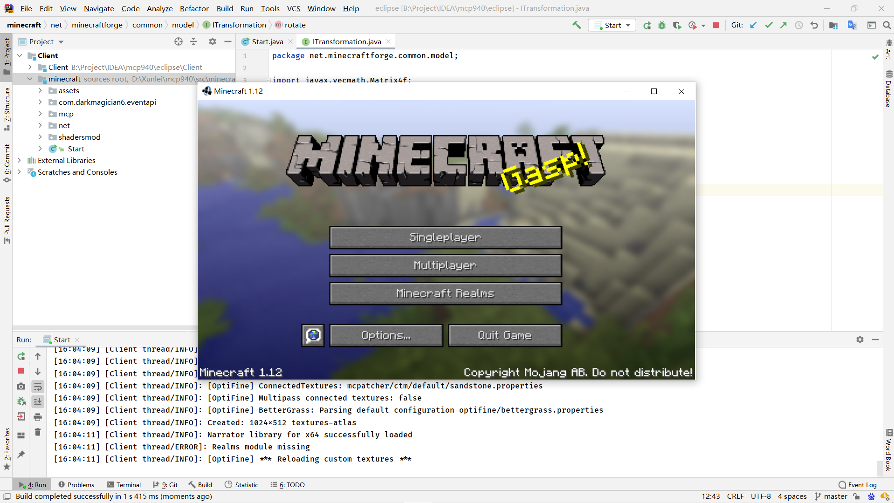

# mcp940
Source code of minecraft 1.12
## How to run
**Note: Please prepare proxy tools such as SSR because of large project file size.**

Clone this project from github to your workspace:

```shell script
git clone https://github.com/WangTingZheng/mcp940
cd mcp940
```
Open IDEA, open another project and select:
```
File-> New-> Project from Existing Sources...
```


Open /eclipse, chose `Import project from external model` and select Eclipse



And click `next`, do not change anything



Deselect `Server` and next:



And next, next until  IDEA open this project, select jdk1.8 and dismiss the error about `Imported project refers to unknown jdks JavaSE-1.6` .



Open Modules facets and add `vecmath-1.5.2.jar` in `/lib` jars to modules Client:



Run main method in  `/minecraft/Start.java`, you will get a exception:


```java
Exception in thread "main" java.lang.UnsatisfiedLinkError: no lwjgl64 in java.library.path
	at java.lang.ClassLoader.loadLibrary(ClassLoader.java:1860)
	at java.lang.Runtime.loadLibrary0(Runtime.java:870)
	at java.lang.System.loadLibrary(System.java:1122)
	at org.lwjgl.Sys$1.run(Sys.java:72)
	at java.security.AccessController.doPrivileged(Native Method)
	at org.lwjgl.Sys.doLoadLibrary(Sys.java:66)
	at org.lwjgl.Sys.loadLibrary(Sys.java:87)
	at org.lwjgl.Sys.<clinit>(Sys.java:117)
	at net.minecraft.client.Minecraft.getSystemTime(Minecraft.java:3282)
	at net.minecraft.client.main.Main.main(Main.java:39)
	at Start.main(Start.java:11)
```

Open `Edit Configurations` :



Fill `Fill in this input box` in `VM options` input box and change `your project folder\ecilpse` to `your project folder\jars` and click ok.



Rerun main method in Start .java



## How to develop

- fork this project to your account
- do [How to run](https://github.com/WangTingZheng/mcp940/#How-to-run) to setup project
- to new a branch and add feature or fix a bug in this new branch
- commit you code and merge new branch to master when feature done or bug fixed
- to my [project](https://github.com/WangTingZheng/mcp940) to new a [pull request](https://github.com/WangTingZheng/mcp940/pulls), I will check your commit and merge into my project
- more detail about how to develop a project in Github please view this [video](https://www.bilibili.com/video/BV1Ff4y1R7cN?p=2)

## Waiting for fixing

- Only support English, No Chinese.
- No any music and sound effects.

## Ref

- [[教程]全民写端-MCP918配置&Optifine装载&EventAPI](https://www.bilibili.com/video/BV1W741127EZ): builds mcp918 bases on minecraft 1.8
- [mcp940.zip](http://www.modcoderpack.com/): The origin source code of Minecraft client 1.12 & server 1.12
- [Optifine SRC Version [1.12 HD U A4]](https://optifinesource.co.uk/downloads/1-12.html): Optifine package
- [DarkMagician6-eventapi.zip](https://bitbucket.org/DarkMagician6/eventapi/downloads/): A event api to listen event in minecraft
- [vecmath-1.5.2.jar](https://mvnrepository.com/artifact/javax.vecmath/vecmath/1.5.2): 3D Vector Math Package
